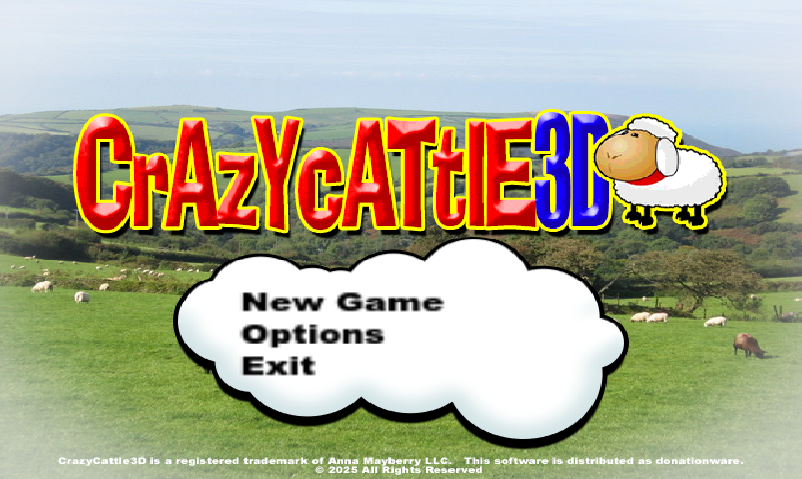

# Crazy Cattle 3D 🐑 - The Ultimate Physics-Based Sheep Battle Royale Game

## 🎮 About the Game

Crazy Cattle 3D is a unique battle royale game where you control an explosive sheep in a physics-based combat environment. Experience the thrill of mastering momentum-based movement and strategic collisions in three distinct global locations.

 [Play Crazy Cattle 3d Now!](https://crazycattle3d.net)

## ✨ Game Features

### 🚀 Revolutionary Physics System
- Realistic sheep movement simulation
- Momentum-based combat mechanics
- Dynamic environmental interactions
- Unpredictable and hilarious gameplay moments

### 🌍 Three Unique Battle Environments
- **Ireland**: Rolling hills perfect for building momentum
- **Iceland**: Volcanic terrain with strategic hazards
- **New Zealand**: Mountainous landscape for vertical gameplay

### 🏆 Pure Skill Progression
- No pay-to-win elements
- Performance-based matchmaking
- Detailed match statistics
- Community ranking system

## 🎯 Controls

### Desktop Controls
- **Movement**: WASD or Arrow Keys
- **Charge**: Spacebar
- **Special Ability**: Left Mouse Button
- **Jump**: E Key
- **Camera**: Mouse Movement

### Mobile Controls
- **Movement**: Virtual Joystick
- **Charge**: Tap and Hold
- **Special Ability**: Special Button
- **Jump**: Jump Button
- **Camera**: Touch and Drag

## 💡 Advanced Strategies

### Momentum Management
- Use downhill slopes to build speed
- Time your charges for maximum impact
- Master the art of controlled landings

### Environmental Tactics
- Leverage terrain features for strategic advantages
- Use obstacles to your advantage
- Identify safe zones and danger areas

### Combat Techniques
- Perfect your collision timing
- Develop spatial awareness
- Create strategic attack patterns

## 📥 Installation

### Web Version
1. Visit [crazycattle3d.net](https://crazycattle3d.net)
2. Click "Play Now" to start playing instantly
3. No installation required

### Desktop Version
1. Download the game from [itch.io](https://4nn4t4t.itch.io/crazycattle3d)
2. Choose your platform (Windows/macOS/Linux)
3. Run the installer
4. Launch the game and start playing

## 🔗 Links

- **Official Website**: [crazycattle3d.net](https://crazycattle3d.net)
- **Download**: [itch.io](https://4nn4t4t.itch.io/crazycattle3d)

## 📝 License

Crazy Cattle 3D is developed and maintained by the Crazy Cattle 3D team. All rights reserved.

---

Made with ❤️ by the Crazy Cattle 3D Team 